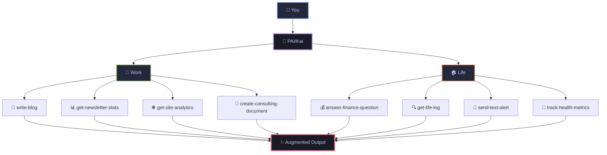

<div align="center">

<picture>
  <source media="(prefers-color-scheme: dark)" srcset="./pai-logo.png">
  <source media="(prefers-color-scheme: light)" srcset="./pai-logo.png">
  
</picture>

# **PAI** - Personal AI Infrastructure

### **Open-source personal AI infrastructure for orchestrating your life and work**

<br/>


[](https://opensource.org/licenses/MIT)
[](https://claude.ai/code)
[](https://youtu.be/iKwRWwabkEc)

<br/>

[](https://github.com/danielmiessler/PAI/stargazers)
[](https://github.com/danielmiessler/PAI/network/members)
[](https://github.com/danielmiessler/PAI/issues)

<br/>

<a href="#-quick-start">
  
</a>
<a href="https://youtu.be/iKwRWwabkEc">
  
</a>
<a href="https://github.com/danielmiessler/PAI/discussions">
  
</a>

<br/>
<br/>

**[Features](#-key-features)** • **[Quick Start](#-quick-start)** • **[Documentation](#-documentation)** • **[Examples](#-examples)** • **[Community](#-community)**

</div>

---

## 🚀 **Recent Updates**

> [!TIP]
> **Check back often as I'm constantly adding features**

<details open>
<summary><strong>📅 September 21, 2025</strong></summary>

- ✨ **Security**: Cleaned up voice server for secure command execution
- 🏠 **Portability**: PAI_HOME support eliminates hardcoded paths
- 📚 **Docs**: Comprehensive documentation under `~/.claude/documentation/`
- 🔌 **Dynamic**: MCP detection via `claude mcp list` (PR #12)
- 🎙️ **Voice**: Enhanced server with validation and rate limiting

</details>

<details>
<summary><strong>📅 Previous Updates</strong></summary>

**September 20, 2025**
- 🗣️ Added `/voice-server` with ElevenLabs integration
- 🔧 Fixed hardcoded path issues
- 🪝 Working on missing hooks

**September 12, 2025**  
- 🧠 Dynamic resource loading system
- ⚡ Submit-user-hook for context loading
- 🗺️ Dynamic routing via load-dynamic-requirements

</details>

---

## 🎯 **What is PAI?**

> **Core Mission:** Augment humans with AI capabilities so they can survive and thrive in a world full of AI.

### 🌍 **The Problem**

**It doesn't matter how powerful AI becomes if it's not in the hands of everyone on Earth.**

Right now, AI is trapped behind corporate APIs, expensive subscriptions, and complex interfaces that only developers can use. Meanwhile, billions of people who could benefit from AI augmentation—artists, teachers, small business owners, researchers, parents—are left behind.

PAI exists to solve this. This project's goal is to give the most powerful AI capabilities, in the form of a complete platform, to everyone on Earth. Not just the tech elite. Not just the wealthy. Everyone.

<div align="center">



</div>

**PAI is an open-source, full personal AI platform that's completely agnostic to who you are and what you're trying to accomplish.**

This isn't just another AI tool—it's a complete infrastructure for anyone on Earth to harness AI for both business and life. Whether you're an artist transitioning to independence, a founder building a company, or someone managing complex health needs, PAI adapts to YOUR unique situation.

PAI is part of the journey toward Human 3.0—where humans are augmented by AI rather than replaced by it.

📖 **[Learn how PAI fits into the Human 3.0 vision](https://danielmiessler.com/blog/how-my-projects-fit-together)**

<table>
<tr>
<td width="33%" valign="top">

### 🧠 **Life Management**

**Finance Intelligence**
- `answer-finance-question` - Analyze bank statements
- `get-finances-state` - Track spending patterns
- Parse PDFs for utility bills and expenses

**Memory & Conversations**
- `get-life-log` - Search recorded meetings
- Query Limitless.ai pendant recordings
- Find what was discussed at any event

**Health Tracking**
- Monitor wellness metrics
- Track medical records
- Analyze sleep and fitness data

</td>
<td width="33%" valign="top">

### 💼 **Professional**

**Content Creation**
- `write-blog` - Generate posts in your style
- `publish-blog` - Deploy to production
- `enhance-content` - Improve existing work

**Business Analytics**
- `get-newsletter-stats` - Beehiiv metrics
- `get-site-analytics` - Website performance
- `create-consulting-document` - Client deliverables

**Development**
- `design-review` - Code analysis
- `browser-tools-setup` - Automation
- `update-daemon` - API management

</td>
<td width="33%" valign="top">

### 🎯 **Personal Growth**

**Knowledge Capture**
- `extract-knowledge` - Learn from content
- `capture-learning` - Document insights
- `web-research` - Deep investigations

**Communication**
- `send-email` - Automated outreach
- `send-text-alert` - SMS notifications
- `send-discord-alert` - Team updates

**Productivity**
- `add-linear-ticket` - Task management
- `create-mermaid-visualization` - Idea mapping
- `query-context` - Access any stored knowledge

</td>
</tr>
</table>

### 🌟 **Why PAI is Different**

- **🌍 Universal**: Works for anyone, anywhere, in any profession or life situation
- **🔓 Open Source**: No vendor lock-in, complete transparency, you own everything
- **🧠 Persistent Memory**: Your AI remembers every context, project, and conversation
- **🎯 Task Agnostic**: From writing a blog to tracking medical data to running a business
- **📁 Plain Text**: All configuration in human-readable files you can edit and understand
- **🔌 Extensible**: Add your own commands, agents, and integrations

📖 **[Read the full technical deep-dive on PAI](https://danielmiessler.com/blog/personal-ai-infrastructure)**

---

## ⚡ **Key Features**

<table>
<tr>
<td width="50%">

### 🏗️ **UFC Context System**

```
~/.claude/context/
├── 🧠 projects/
├── 🛠️ tools/
├── 💰 finances/
├── 🏥 health/
└── 🎯 telos/
```

✅ Persistent memory across sessions  
✅ Hierarchical organization  
✅ Plain text portability  
✅ Dynamic loading

</td>
<td width="50%">

### 🤖 **Specialized Agents**

| Agent | Specialization |
|-------|---------------|
| 🔬 **Researcher** | Deep synthesis |
| 💻 **Engineer** | Production code |
| 🎨 **Designer** | UX/UI design |
| 🔒 **Pentester** | Security testing |
| 📐 **Architect** | System design |

✅ Task-specific expertise  
✅ Voice personalities  
✅ Tool integration  
✅ Parallel execution

</td>
</tr>
</table>

<details>
<summary><strong>🔧 Integrated Tool Ecosystem</strong></summary>

<br/>

| Category | Tools |
|----------|-------|
| **🎭 Automation** | Playwright, Puppeteer, Selenium |
| **💳 Financial** | Stripe, Square, PayPal |
| **📊 Analytics** | Google Analytics, Mixpanel |
| **🗣️ Voice** | ElevenLabs, OpenAI TTS |
| **🔌 MCPs** | Custom servers for any API |

</details>

---

## 🚀 **Quick Start**

> [!NOTE]
> PAI requires [Claude Code](https://claude.ai/code) and [Bun](https://bun.sh) runtime.

### **Installation**

#### **Step 1: Install Prerequisites**

```bash
# Install Bun (JavaScript runtime)
brew install bun

# Get Claude Code (AI interface)
# Visit: https://claude.ai/code
```

#### **Step 2: Clone PAI Repository**

```bash
# Clone the PAI repository
git clone https://github.com/danielmiessler/PAI.git
cd PAI

# Note: .claude directory is hidden by default
ls -la  # See all files including .claude
```

#### **Step 3: Configure Environment**

```bash
# Copy environment template
cp .env.example ~/.env

# Add your API keys (optional but recommended)
vim ~/.env
# Add: ELEVENLABS_API_KEY="your_key_here"
# Add: OPENAI_API_KEY="your_key_here"
```

#### **Step 4: Set PAI_HOME Variable**

```bash
# Add to your shell config (~/.zshrc or ~/.bashrc)
export PAI_HOME="$HOME"

# Reload your shell configuration
source ~/.zshrc  # or source ~/.bashrc
```

#### **Step 5: Launch PAI**

```bash
# Navigate to PAI directory
cd ~/.claude

# Optional: Start voice server for audio notifications
cd voice-server && ./install.sh && ./start.sh

# Open Claude Code and start using PAI!
# Your personal AI infrastructure is ready 🚀
```

### **⚙️ Environment Variables**

```bash
# Required
PAI_HOME="/path/to/pai"           # PAI installation directory

# Optional
ELEVENLABS_API_KEY="your_key"     # Voice synthesis
OPENAI_API_KEY="your_key"         # GPT integration
PORT="8888"                        # Voice server port
```

---

## 📚 **Documentation**

<div align="center">

| 📖 Guide | 🎯 Purpose | ⏱️ Time |
|----------|------------|---------|
| [Quick Start](./docs/quick-start.md) | Get up and running | 5 min |
| [Architecture](./docs/architecture.md) | Understand the system | 10 min |
| [UFC Context](./docs/ufc-context.md) | Master context management | 15 min |
| [Agents](./docs/agents.md) | Work with AI agents | 10 min |
| [Voice Server](./docs/voice-server.md) | Enable voice interaction | 10 min |

</div>

---

## 🎬 **Real-World Examples**

### 📈 **Business & Analytics**

<details>
<summary><strong>📊 Newsletter Performance</strong></summary>

```bash
# Track newsletter metrics in real-time
get-newsletter-stats
# Returns subscriber growth, open rates, top content
```

</details>

<details>
<summary><strong>🚀 Startup Dashboard</strong></summary>

```bash
# Monitor all key metrics
get-site-analytics        # Traffic and conversions
get-finances-state        # Revenue tracking
add-linear-ticket         # Development velocity
```

</details>

### 💰 **Financial Intelligence**

<details>
<summary><strong>📉 Expense Analysis</strong></summary>

```bash
# Instant financial insights
answer-finance-question "monthly utilities average?"
answer-finance-question "subscription spending?"
process-finances-data --categorize --visualize
```

</details>

<details>
<summary><strong>📈 Financial Planning</strong></summary>

```bash
# Comprehensive financial overview
get-finances-state
prepare-finances-dashboard
push-finances-state --notify
```

</details>

### ✍️ **Content Creation**

<details>
<summary><strong>📝 Blog Pipeline</strong></summary>

```bash
# End-to-end content creation
web-research "emerging AI trends"
extract-knowledge --key-points
write-blog --style personal --length 1500
enhance-content --seo --readability
publish-blog --schedule tomorrow
```

</details>

<details>
<summary><strong>🎨 Visual Content</strong></summary>

```bash
# Create stunning visualizations
create-d3-visualization --data metrics.json
create-custom-image "futuristic AI assistant"
create-mermaid-visualization --type flowchart
```

</details>

### 🧪 **Memory & Research**

<details>
<summary><strong>🔍 Meeting Recall</strong></summary>

```bash
# Never forget a conversation
get-life-log "investor meeting last week"
get-life-log "product roadmap decisions"
query-context "action items from standup"
```

</details>

<details>
<summary><strong>📚 Knowledge Building</strong></summary>

```bash
# Build your second brain
capture-learning --source conference
extract-knowledge --summarize
learn-from-iterations --improve
query-context "machine learning notes"
```

</details>

### 🎯 **Personal Productivity**

<details>
<summary><strong>툿 Morning Automation</strong></summary>

```bash
# Start your day right
get-life-log "yesterday's highlights"
query-context "today's priorities"
send-text-alert "heading to office"
reset-visitor-peak  # Reset daily counters
```

</details>

<details>
<summary><strong>📧 Smart Communication</strong></summary>

```bash
# Intelligent outreach
send-email --template followup
send-discord-alert --channel team
add-links --resource documentation
update-public-content
```

</details>

### 🔒 **Development & Security**

<details>
<summary><strong>🔍 Code Security</strong></summary>

```bash
# Security automation
check-for-sensitive --scan all
design-review --security-focus
browser-tools-setup --headers
```

</details>

<details>
<summary><strong>🔌 API Infrastructure</strong></summary>

```bash
# Personal API management
update-daemon --endpoints
create-cloudflare-mcp-server
update-tools-context --integrations
startup-context-load
```

</details>

---

## 🤝 **Community**

<div align="center">

### **Help Us Give AI to the World**

<a href="https://github.com/danielmiessler/PAI/issues">
  
</a>
<a href="https://github.com/danielmiessler/PAI/discussions">
  
</a>
<a href="https://github.com/danielmiessler/PAI/pulls">
  
</a>

<br/>
<br/>

**⭐ Star this repo** to stay updated with the latest features!

</div>

---

## 📄 **License**

PAI is MIT licensed. See [LICENSE](./LICENSE) for details.

---

<div align="center">

### **The Path to Human 3.0**

> *"PAI isn't about AI replacing you—it's about becoming augmented. It's about having perfect memory, infinite analysis, and creative superpowers while remaining fundamentally human."*

<br/>

**Created by [Daniel Miessler](https://danielmiessler.com)**

📧 **[Newsletter](https://newsletter.danielmiessler.com)** • 📝 **[Blog](https://danielmiessler.com/blog)** • 💼 **[LinkedIn](https://linkedin.com/in/danielmiessler)** • 🎬 **[YouTube](https://www.youtube.com/@unsupervised-learning)**

<br/>

<a href="#">
  
</a>

</div>