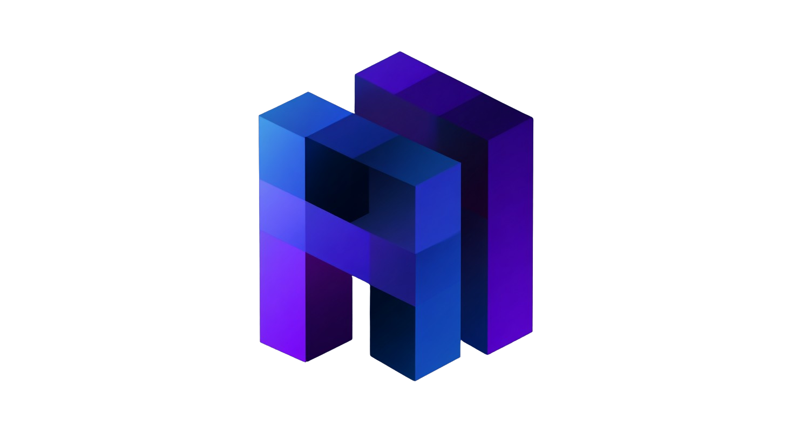

<div align="center">



# `PAI` - Personal AI Infrastructure

### <code>PAI</code> is an open-source personal AI infrastructure for orchestrating your life and work

<br />


[](https://opensource.org/licenses/MIT)
[](https://claude.ai/code)
[](https://youtu.be/iKwRWwabkEc)

<p align="center">
  <a href="#-features">Features</a> •
  <a href="#-getting-started">Getting Started</a> •
  <a href="#-philosophy">Philosophy</a> •
  <a href="#-examples">Examples</a> •
  <a href="#-contribute">Contribute</a>
</p>

---

</div>

#### 💥 UPDATES (September 12, 2025)

- Just uploaded my new dynamic resource loading system to `/hooks` and `/commands`
- It works by leveraging the submit-user-hook to *dynamically* load context and agents
- The file that handles dynamic routing is `/commands/load-dynamic-requirements.md`
- The file is loaded through the hooks in `settings.json`, specifically the submit-user-prompt hooks
- That hook points to `/hooks/load-dynamic-requirements.ts`, which loads `/commands/load-dynamic-requirements.md`

#### 💥 UPDATES (September 10, 2025)

- Initial creation of the repo and loading of the base content

## 🎯 **What is PAI?**

PAI is a project designed to give anyone in the world a personal AI infrastructure for orchestrating their personal and professional lives.

Based off my own personal Digital Assistant, **Kai**, it combines a scaffolding framework with a growing set of real-world examples.

<table>
<tr>
<td width="33%" align="center"><b>🧠 Life Management</b><br/>Research • Writing • Health • Finances</td>
<td width="33%" align="center"><b>💼 Professional</b><br/>Code • Content • Analytics • Automation<br/>Department Management • Program Management • Startups</td>
<td width="33%" align="center"><b>🎯 Personal</b><br/>Learning • Family • Goals • Habits</td>
</tr>
</table>

> **💡 Core Mission:** Augment humans with AI capabilities so they can survive and thrive in a world full of AI.

<br/>

## ✨ **Features**

<details open>
<summary><b>🏗️ UFC Context Architecture - Your Persistent AI Brain</b></summary>

```
~/.claude/context/
├── 🧠 projects/         # Active work and initiatives
├── 🛠️ tools/           # AI agents and capabilities  
├── 💰 finances/        # Financial tracking and analysis
├── 🏥 health/          # Wellness and medical data
└── 🎯 telos/           # Objectives and progress tracking
```

- **Persistent Memory**: Never lose context between sessions
- **Hierarchical Organization**: Intuitive file-based structure
- **Complete Portability**: Your entire AI brain in plain text
- **Dynamic Loading**: Context loads based on current task

</details>

<details>
<summary><b>🤖 Specialized Digital Assistants</b></summary>

| Assistant | Purpose | Voice ID | Specialization |
|-----------|---------|----------|----------------|
| **Researcher** | Deep information synthesis | `AXdMgz6...` | Web research, analysis |
| **Engineer** | Production code development | `kmSVBPu7...` | Full-stack, testing |
| **Designer** | UX/UI and visual design | `ZF6FPAb...` | Interfaces, experiences |
| **Pentester** | Security assessment | `hmMWXCj9...` | Vulnerability testing |
| **Architect** | System design | `muZKMsID...` | Technical specifications |

</details>

<details>
<summary><b>🔧 Integrated Tool Ecosystem</b></summary>

- **MCP Servers**: Playwright, Stripe, Apify, and more
- **Voice System**: Natural conversation with TTS/STT
- **Browser Automation**: Visual testing and web interaction
- **API Integrations**: Connect any service to your PAI

</details>

<br/>

## 🚀 **Getting Started**

> **📢 Note:** Lots more examples and templates coming soon, including the full voice implementation. This repo will be continuously updated with real-world implementations from my [YouTube channel](https://www.youtube.com/@unsupervised-learning).

### **Quick Start**

One thing to note is that when you download the project, the.Claude directory is hidden by default because it's a dot directory. So cd into `.claude` when you're done with the instructions.

`cd .claude`

```bash
# 1. Clone the repository
git clone https://github.com/danielmiessler/PAI.git

# 2. Check out the files (the folder is hidden with default `ls`)

ls -lah
cd ~/.claude/
ls -lah

```

### **Prerequisites**

- [Claude Code](https://claude.ai/code) - The primary AI interface, which can be any similar system
- Text editor (any will work - it's all Markdown/Text!)
- Ideal: Basic command line familiarity

<br/>

## 💡 **Philosophy**

<div align="center">

### **Human 3.0: Augmentation, Not Replacement**

</div>

The PAI system embodies a fundamental belief: **AI should amplify human capability, not replace it.**

| Traditional AI | PAI Approach |
|----------------|--------------|
| Black box decisions | Transparent, file-based logic |
| Vendor lock-in | Completely portable |
| Forgets everything | Persistent memory |
| Generic responses | Personalized to you |
| Replaces thinking | Augments capability |

<br/>

## 📚 **Examples**

Coming soon! Each example will include:
- Complete file structure
- Configuration templates  
- Step-by-step setup
- Video walkthrough

### **Planned Examples**
- 📰 Daily Intelligence Briefing
- 💰 Expense Tracking & Analysis
- 📝 Content Creation Pipeline
- 🔬 Research Assistant
- 🏥 Health Monitoring
- 📚 Learning System

<br/>

## 🤝 **Contribute**

PAI is open source and welcomes contributions!

- 🐛 [Report Issues](https://github.com/danielmiessler/PAI/issues)
- 💡 [Suggest Features](https://github.com/danielmiessler/PAI/discussions)
- 🔧 [Submit PRs](https://github.com/danielmiessler/PAI/pulls)
- ⭐ Star the repo to show support!

<br/>

## 📄 **License**

PAI is MIT licensed. See [LICENSE](./LICENSE) for details.

<br/>

---

<div align="center">

### 🎓 **Remember**

> *"This is YOUR infrastructure. Every configuration, every tool, every workflow should serve your unique life and goals. You're not using AI—you're augmenting yourself with it."*

**by [Daniel Miessler](https://danielmiessler.com) • Follow along on [YouTube](https://www.youtube.com/@unsupervised-learning)**

</div>
