<div align="center">

<picture>
  <source media="(prefers-color-scheme: dark)" srcset="./pai-logo.png">
  <source media="(prefers-color-scheme: light)" srcset="./pai-logo.png">
  
</picture>

# **PAI** - Personal AI Infrastructure

### **Open-source personal AI infrastructure for orchestrating your life and work**

<br/>


[](https://opensource.org/licenses/MIT)
[](https://claude.ai/code)
[](https://youtu.be/iKwRWwabkEc)


<br/>

[](https://github.com/danielmiessler/PAI/stargazers)
[](https://github.com/danielmiessler/PAI/network/members)
[](https://github.com/danielmiessler/PAI/issues)

<br/>

**[Features](#-key-features)** • **[Quick Start](#-quick-start)** • **[Documentation](#-documentation)** • **[Examples](#-examples)** • **[Community](#-community)**

</div>

---

## 🚀 **Recent Updates**

> [!TIP]
> **[🎉 v0.1 Released!](https://github.com/danielmiessler/PAI/releases/tag/v0.1)** - First official release with full architecture documentation

<details open>
<summary><strong>📅 September 21, 2025 - v0.1 Release</strong></summary>

- 🎉 **Release**: Published v0.1 - Initial public release
- 🔒 **Voice**: Hardened the voice server
- 🏠 **Portability**: PAI_HOME support eliminates hardcoded paths
- 📚 **Docs**: Comprehensive documentation under `~/.claude/documentation/`
- 🔌 **Dynamic**: MCP detection via `settings.json`
- 🏗️ **Architecture**: Complete system documentation with examples

</details>

<details>
<summary><strong>📅 Previous Updates</strong></summary>

**September 20, 2025**
- 🗣️ Added `/voice-server` with ElevenLabs integration
- 🔧 Fixed hardcoded path issues
- 🪝 Working on missing hooks

**September 12, 2025**  
- 🧠 Dynamic resource loading system
- ⚡ Submit-user-hook for context loading
- 🗺️ Dynamic routing via load-dynamic-requirements

</details>

---

## 🎯 **What is PAI?**

> **Core Mission:** Augment humans with AI capabilities so they can survive and thrive in a world full of AI.

```mermaid
graph TB
    You[👤 You] --> PAI[🧠 PAI/Kai]
    
    PAI --> Work[💼 Work]
    PAI --> Life[🏠 Life]
    
    Work --> Blog[📝 write-blog]
    Work --> News[📊 get-newsletter-stats]
    Work --> Site[🌐 get-site-analytics]
    Work --> Consult[💼 create-consulting-document]
    
    Life --> Finance[💰 answer-finance-question]
    Life --> Memory[🔍 get-life-log]
    Life --> Alert[🔔 send-text-alert]
    Life --> Health[🏥 track-health-metrics]
    
    Blog --> Output[✨ Augmented Output]
    News --> Output
    Site --> Output
    Consult --> Output
    Finance --> Output
    Memory --> Output
    Alert --> Output
    Health --> Output
    
    style You fill:#24283b,stroke:#7aa2f7,stroke-width:2px,color:#c0caf5
    style PAI fill:#1a1b26,stroke:#bb9af7,stroke-width:3px,color:#c0caf5
    style Work fill:#24283b,stroke:#9ece6a,stroke-width:2px,color:#c0caf5
    style Life fill:#24283b,stroke:#ff9e64,stroke-width:2px,color:#c0caf5
    style Output fill:#1a1b26,stroke:#f7768e,stroke-width:3px,color:#c0caf5
```

### 🌍 **The Problem**

**It doesn't matter how powerful AI becomes if it's not in the hands of everyone on Earth.**

Right now, AI is trapped behind corporate APIs, expensive subscriptions, and complex interfaces that only developers can use. Meanwhile, billions of people who could benefit from AI augmentation—artists, teachers, small business owners, researchers, parents—are left behind.

PAI exists to solve this. This project's goal is to give the most powerful AI capabilities, in the form of a complete platform, to everyone on Earth. Not just the tech elite. Not just the wealthy. Everyone.

<div align="center">



</div>

**PAI is an open-source, full personal AI platform that's completely agnostic to who you are and what you're trying to accomplish.**

Think of PAI as your personal AI that actually knows you—all your projects, your style, your data—and can handle anything you throw at it. Whether you're an artist transitioning to independence, a founder building a company, or someone managing complex health needs, PAI becomes whatever you need it to be.

PAI is part of the journey toward Human 3.0—where humans are augmented by AI to amplify their capabilities.

📖 **[Learn how PAI fits into the Human 3.0 vision](https://danielmiessler.com/blog/how-my-projects-fit-together)**

<table>
<tr>
<td width="33%" valign="top">

### 🧠 **Life Management**

**Finance Intelligence**
- `answer-finance-question` - Analyze bank statements
- `get-finances-state` - Track spending patterns
- Parse PDFs for utility bills and expenses

**Memory & Conversations**
- `get-life-log` - Search recorded meetings
- Query Limitless.ai pendant recordings
- Find what was discussed at any event

**Health Tracking**
- Monitor wellness metrics
- Track medical records
- Analyze sleep and fitness data

</td>
<td width="33%" valign="top">

### 💼 **Professional**

**Content Creation**
- `write-blog` - Generate posts in your style
- `publish-blog` - Deploy to production
- `enhance-content` - Improve existing work

**Business Analytics**
- `get-newsletter-stats` - Beehiiv metrics
- `get-site-analytics` - Website performance
- `create-consulting-document` - Client deliverables

**Development**
- `design-review` - Code analysis
- `browser-tools-setup` - Automation
- `update-daemon` - API management

</td>
<td width="33%" valign="top">

### 🎯 **Personal Growth**

**Knowledge Capture**
- `extract-knowledge` - Learn from content
- `capture-learning` - Document insights
- `web-research` - Deep investigations

**Communication**
- `send-email` - Automated outreach
- `send-text-alert` - SMS notifications
- `send-discord-alert` - Team updates

**Productivity**
- `add-linear-ticket` - Task management
- `create-mermaid-visualization` - Idea mapping
- `query-context` - Access any stored knowledge

</td>
</tr>
</table>

### 🌟 **Why PAI is Different**

- **🌍 Universal**: Works for anyone, anywhere, in any profession or life situation
- **🔓 Open Source**: No vendor lock-in, complete transparency, you own everything
- **🤖 Platform Independent**: Core structure works with Claude, GPT, Gemini, or any AI platform
- **🧠 Persistent Memory**: Your AI remembers every context, project, and conversation
- **🎯 Task Agnostic**: From writing a blog to tracking medical data to running a business
- **📁 Plain Text**: All configuration in human-readable files you can edit and understand
- **🔌 Extensible**: Add your own commands, agents, and integrations

📖 **[Read the full technical deep-dive on PAI](https://danielmiessler.com/blog/personal-ai-infrastructure)**

---

## ⚡ **Architecture**

### 🏗️ **The PAI System Architecture**

```mermaid
graph TD
    User[👤 You] --> Hooks[🪝 Dynamic Hooks]
    
    Hooks --> UFC[📁 UFC Context System]
    Hooks --> Commands[⚡ Custom Commands]
    
    UFC --> Projects[🧠 Projects]
    UFC --> Life[🏠 Life Context]
    UFC --> Work[💼 Work Context]
    
    Commands --> MCPs[🔌 MCP Servers]
    Commands --> Agents[🤖 AI Agents]
    Commands --> APIs[🌐 API Integrations]
    
    MCPs --> Playwright[🎭 Browser Automation]
    MCPs --> Stripe[💳 Payment Processing]
    MCPs --> Analytics[📊 Analytics]
    
    Agents --> Output[✨ Augmented Actions]
    APIs --> Output
    MCPs --> Output
    
    style User fill:#1f2937,stroke:#10b981,stroke-width:2px,color:#e5e7eb
    style Hooks fill:#111827,stroke:#8b5cf6,stroke-width:2px,color:#e5e7eb
    style Output fill:#111827,stroke:#ef4444,stroke-width:2px,color:#e5e7eb
```



<table>
<tr>
<td width="33%" valign="top">

### 📁 **UFC Context System**

```
~/.claude/context/
├── projects/
│   ├── website/
│   ├── Alma/
│   └── PAI/
├── life/
│   ├── finances/
│   ├── health/
│   └── expenses/
├── work/
│   ├── consulting/
│   └── business/
└── benefits/
    └── credit-cards/
```

**Features:**
- Persistent memory
- Plain text files
- Dynamic loading
- Hierarchical organization

</td>
<td width="33%" valign="top">

### ⚡ **Custom Commands**

**Professional:**
- `write-blog` - Content generation
- `get-newsletter-stats` - Beehiiv metrics
- `design-review` - Code analysis
- `create-consulting-document`
- `update-daemon` - API management

**Personal:**
- `answer-finance-question`
- `get-life-log` - Limitless.ai integration
- `send-text-alert` - SMS notifications
- `track-health-metrics`
- `capture-learning`

**60+ commands** ready to use

</td>
<td width="33%" valign="top">

### 🤖 **Specialized Agents**

| Agent | Purpose | Tools |
|-------|---------|-------|
| **Researcher** | Deep web research | WebSearch, WebFetch |
| **Engineer** | Production code | Testing, Debugging |
| **Designer** | UX/UI design | Figma, shadcn/ui |
| **Pentester** | Security | Nmap, Burp |
| **Architect** | System design | Diagrams, PRDs |

**With:**
- ElevenLabs voices
- Task parallelization
- Tool integration

</td>
</tr>
</table>

### 🪝 **Dynamic Hook System**

<table>
<tr>
<td width="50%">

**Context Loading Hooks:**
- `submit-user-hook` - Loads context based on intent
- `load-dynamic-requirements` - Smart routing
- Automatic agent selection
- Domain-specific knowledge injection

</td>
<td width="50%">

**Integration Hooks:**
- Pre/post command execution
- Error handling and recovery
- Rate limiting and validation
- Security scanning

</td>
</tr>
</table>

### 🔌 **MCP Server Ecosystem**

<table>
<tr>
<td width="25%">

**Browser & Testing**
- Playwright
- Puppeteer
- Selenium
- Visual regression

</td>
<td width="25%">

**Financial**
- Stripe API
- Square
- PayPal
- Crypto wallets

</td>
<td width="25%">

**Analytics**
- Google Analytics
- Mixpanel
- Beehiiv
- Site metrics

</td>
<td width="25%">

**Communication**
- ElevenLabs TTS
- OpenAI Voice
- Discord
- Email/SMS

</td>
</tr>
</table>

---

## 🚀 **Quick Start**

> [!NOTE]
> PAI works with [Claude Code](https://claude.ai/code), but the architecture supports any AI platform (GPT, Gemini, etc.)
> Requires [Bun](https://bun.sh) JavaScript runtime for the current implementation.

### **Installation**

#### **Step 1: Install Prerequisites**

```bash
# Install Bun (JavaScript runtime)
brew install bun

# Get Claude Code (AI interface)
# Visit: https://claude.ai/code
```

#### **Step 2: Clone PAI Repository**

```bash
# Clone the PAI repository
git clone https://github.com/danielmiessler/PAI.git
cd PAI

# Note: .claude directory is hidden by default
ls -la  # See all files including .claude
```

#### **Step 3: Configure Environment**

```bash
# Copy environment template
cp .env.example ~/.env

# Add your API keys (optional but recommended)
vim ~/.env
# Add: ELEVENLABS_API_KEY="your_key_here"
# Add: OPENAI_API_KEY="your_key_here"
```

#### **Step 4: Set PAI_HOME Variable**

```bash
# Add to your shell config (~/.zshrc or ~/.bashrc)
export PAI_HOME="$HOME"

# Reload your shell configuration
source ~/.zshrc  # or source ~/.bashrc
```

#### **Step 5: Launch PAI**

```bash
# Navigate to PAI directory
cd ~/.claude

# Optional: Start voice server for audio notifications
cd voice-server && ./install.sh && ./start.sh

# Open Claude Code and start using PAI!
# Your personal AI infrastructure is ready 🚀
```

### **⚙️ Environment Variables**

```bash
# Required
PAI_HOME="/path/to/pai"           # PAI installation directory

# Optional
ELEVENLABS_API_KEY="your_key"     # Voice synthesis
OPENAI_API_KEY="your_key"         # GPT integration
PORT="8888"                        # Voice server port
```

---

## 📚 **Documentation**

<div align="center">

| 📖 Guide | 🎯 Purpose | ⏱️ Time |
|----------|------------|---------|
| [Quick Start](#-quick-start) | Get up and running | 5 min |
| [Architecture](#-architecture) | Understand the system | 10 min |
| [SECURITY.md](./SECURITY.md) | Security guidelines | 5 min |
| [Voice Server](./.claude/voice-server/README.md) | Enable voice interaction | 10 min |
| [Commands Directory](./.claude/commands/) | Browse all commands | 15 min |

</div>

---

## 🎬 **Real-World Examples**

<div align="center">

> **Note:** These are examples from my personal PAI setup. Your system will have completely different commands based on your unique needs, workflows, and goals.

</div>

<table>
<tr>
<td width="33%" valign="top">

### 💼 **Professional**

#### 📈 **Business & Analytics**

<details>
<summary><strong>📊 Newsletter Performance</strong></summary>

```bash
# Track newsletter metrics in real-time
get-newsletter-stats
# Returns subscriber growth, open rates, top content
```

</details>

<details>
<summary><strong>🚀 Startup Dashboard</strong></summary>

```bash
# Monitor all key metrics
get-site-analytics        # Traffic and conversions
get-finances-state        # Revenue tracking
add-linear-ticket         # Development velocity
```

</details>

#### 🔒 **Development & Security**

<details>
<summary><strong>🔍 Code Security</strong></summary>

```bash
# Security automation
check-for-sensitive --scan all
design-review --security-focus
browser-tools-setup --headers
```

</details>

<details>
<summary><strong>🔌 API Infrastructure</strong></summary>

```bash
# Personal API management
update-daemon --endpoints
create-cloudflare-mcp-server
update-tools-context --integrations
startup-context-load
```

</details>

#### ✍️ **Content Creation**

<details>
<summary><strong>📝 Blog Pipeline</strong></summary>

```bash
# End-to-end content creation
web-research "emerging AI trends"
extract-knowledge --key-points
write-blog --style personal --length 1500
enhance-content --seo --readability
publish-blog --schedule tomorrow
```

</details>

<details>
<summary><strong>🎨 Visual Content</strong></summary>

```bash
# Create stunning visualizations
create-d3-visualization --data metrics.json
create-custom-image "futuristic AI assistant"
create-mermaid-visualization --type flowchart
```

</details>

</td>
<td width="33%" valign="top">

### 🏠 **Personal**

#### 💰 **Financial Intelligence**

<details>
<summary><strong>📉 Expense Analysis</strong></summary>

```bash
# Instant financial insights
answer-finance-question "monthly utilities average?"
answer-finance-question "subscription spending?"
process-finances-data --categorize --visualize
```

</details>

<details>
<summary><strong>📈 Financial Planning</strong></summary>

```bash
# Comprehensive financial overview
get-finances-state
prepare-finances-dashboard
push-finances-state --notify
```

</details>

#### 🧪 **Memory & Research**

<details>
<summary><strong>🔍 Meeting Recall</strong></summary>

```bash
# Never forget a conversation
get-life-log "investor meeting last week"
get-life-log "product roadmap decisions"
query-context "action items from standup"
```

</details>

<details>
<summary><strong>📚 Knowledge Building</strong></summary>

```bash
# Build your second brain
capture-learning --source conference
extract-knowledge --summarize
learn-from-iterations --improve
query-context "machine learning notes"
```

</details>

#### 🎯 **Personal Productivity**

<details>
<summary><strong>툿 Morning Automation</strong></summary>

```bash
# Start your day right
get-life-log "yesterday's highlights"
query-context "today's priorities"
send-text-alert "heading to office"
reset-visitor-peak  # Reset daily counters
```

</details>

<details>
<summary><strong>📧 Smart Communication</strong></summary>

```bash
# Intelligent outreach
send-email --template followup
send-discord-alert --channel team
add-links --resource documentation
update-public-content
```

</details>

</td>
<td width="33%" valign="top">

### 🎨 **Creative & Other Fields**

#### 🎭 **Artist Workflow**

<details>
<summary><strong>🎨 Creative Portfolio</strong></summary>

```bash
# Manage artistic work
track-project-progress "oil painting series"
generate-artist-statement --style contemporary
update-portfolio-website --new-pieces
schedule-gallery-submission --deadline friday
```

</details>

<details>
<summary><strong>📷 Photography Business</strong></summary>

```bash
# End-to-end photography workflow
process-shoot-metadata --wedding-2024-09
generate-client-gallery --password-protected
send-invoice --client johnson-wedding
backup-raw-files --cloud-storage
```

</details>

#### 🎵 **Musician Setup**

<details>
<summary><strong>🎤 Music Production</strong></summary>

```bash
# Creative music workflow
track-song-ideas --voice-memo-to-text
generate-chord-progressions --key-of-c
schedule-studio-time --next-available
export-stems --for-mixing
```

</details>

#### 🌿 **Health & Wellness Coach**

<details>
<summary><strong>🏋️ Client Management</strong></summary>

```bash
# Wellness practice automation
track-client-progress --weekly-checkin
generate-meal-plans --dietary-restrictions
send-motivation-message --personalized
schedule-follow-up --in-two-weeks
```

</details>

#### 📚 **Academic Researcher**

<details>
<summary><strong>🔬 Research Pipeline</strong></summary>

```bash
# Academic workflow
search-literature --keywords "machine learning ethics"
organize-citations --zotero-import
generate-literature-review --outline
track-experiment-results --statistical-analysis
```

</details>

#### 🏠 **Real Estate Agent**

<details>
<summary><strong>🏡 Property Management</strong></summary>

```bash
# Real estate automation
analyze-market-trends --neighborhood-data
generate-property-reports --comparative-analysis
schedule-showings --calendar-optimization
send-client-updates --weekly-digest
```

</details>

</td>
</tr>
</table>

---

## 🤝 **Community**

<div align="center">

### **Help Us Give AI to the World**

<a href="https://github.com/danielmiessler/PAI/issues">
  
</a>
<a href="https://github.com/danielmiessler/PAI/discussions">
  
</a>
<a href="https://github.com/danielmiessler/PAI/pulls">
  
</a>

<br/>
<br/>

**⭐ Star this repo** to stay updated with the latest features!

</div>

---

## 📄 **License**

PAI is MIT licensed. See [LICENSE](./LICENSE) for details.

---

<div align="center">

### **The Path to Human 3.0**

> *"Humans are what matters. AI is only useful as it is to humans. The reason I'm building all of this is so that people have a chance to compete with AI in this world that is coming."*

<br/>

**Created by [Daniel Miessler](https://danielmiessler.com)**

📧 **[Newsletter](https://newsletter.danielmiessler.com)** • 📝 **[Blog](https://danielmiessler.com/blog)** • 💼 **[LinkedIn](https://linkedin.com/in/danielmiessler)** • 🎬 **[YouTube](https://www.youtube.com/@unsupervised-learning)**

<br/>

<a href="#">
  
</a>

</div>