<div align="center">

<picture>
  <source media="(prefers-color-scheme: dark)" srcset="./pai-logo.png">
  <source media="(prefers-color-scheme: light)" srcset="./pai-logo.png">
  
</picture>

# **PAI** - Personal AI Infrastructure

### **Open-source personal AI infrastructure for orchestrating your life and work**

<br/>


[](https://opensource.org/licenses/MIT)
[](https://claude.ai/code)
[](https://youtu.be/iKwRWwabkEc)

<br/>

[](https://github.com/danielmiessler/PAI/stargazers)
[](https://github.com/danielmiessler/PAI/network/members)
[](https://github.com/danielmiessler/PAI/issues)

<br/>

<a href="#-quick-start">
  
</a>
<a href="https://youtu.be/iKwRWwabkEc">
  
</a>
<a href="https://github.com/danielmiessler/PAI/discussions">
  
</a>

<br/>
<br/>

**[Features](#-key-features)** • **[Quick Start](#-quick-start)** • **[Documentation](#-documentation)** • **[Examples](#-examples)** • **[Community](#-community)**

</div>

---

## 🚀 **Recent Updates**

> [!TIP]
> **Latest Release**: v1.0.0 - September 21, 2025

<details open>
<summary><strong>📅 September 21, 2025</strong></summary>

- ✨ **Security**: Cleaned up voice server for secure command execution
- 🏠 **Portability**: PAI_HOME support eliminates hardcoded paths
- 📚 **Docs**: Comprehensive documentation under `~/.claude/documentation/`
- 🔌 **Dynamic**: MCP detection via `claude mcp list` (PR #12)
- 🎙️ **Voice**: Enhanced server with validation and rate limiting

</details>

<details>
<summary><strong>📅 Previous Updates</strong></summary>

**September 20, 2025**
- 🗣️ Added `/voice-server` with ElevenLabs integration
- 🔧 Fixed hardcoded path issues
- 🪝 Working on missing hooks

**September 12, 2025**  
- 🧠 Dynamic resource loading system
- ⚡ Submit-user-hook for context loading
- 🗺️ Dynamic routing via load-dynamic-requirements

</details>

---

## 🎯 **What is PAI?**

> **Core Mission:** Augment humans with AI capabilities so they can survive and thrive in a world full of AI.

```mermaid
graph TB
    You[👤 You] --> PAI[🧠 PAI/Kai]
    
    PAI --> Work[💼 Work]
    PAI --> Life[🏠 Life]
    
    Work --> Blog[📝 write-blog]
    Work --> News[📊 get-newsletter-stats]
    Work --> Site[🌐 get-site-analytics]
    Work --> Consult[💼 create-consulting-document]
    
    Life --> Finance[💰 answer-finance-question]
    Life --> Memory[🔍 get-life-log]
    Life --> Alert[🔔 send-text-alert]
    Life --> Health[🏥 track-health-metrics]
    
    Blog --> Output[✨ Augmented Output]
    News --> Output
    Site --> Output
    Consult --> Output
    Finance --> Output
    Memory --> Output
    Alert --> Output
    Health --> Output
    
    style You fill:#24283b,stroke:#7aa2f7,stroke-width:2px,color:#c0caf5
    style PAI fill:#1a1b26,stroke:#bb9af7,stroke-width:3px,color:#c0caf5
    style Work fill:#24283b,stroke:#9ece6a,stroke-width:2px,color:#c0caf5
    style Life fill:#24283b,stroke:#ff9e64,stroke-width:2px,color:#c0caf5
    style Output fill:#1a1b26,stroke:#f7768e,stroke-width:3px,color:#c0caf5
```

<div align="center">



</div>

PAI is designed to give anyone a personal AI infrastructure that:

<table>
<tr>
<td align="center" width="33%">
  
### 🧠 **Life Management**
Research • Writing • Health • Finance

</td>
<td align="center" width="33%">

### 💼 **Professional**
Code • Analytics • Automation • Strategy

</td>
<td align="center" width="33%">

### 🎯 **Personal**
Learning • Goals • Habits • Growth

</td>
</tr>
</table>

Based on my own personal Digital Assistant **Kai**, PAI combines a scaffolding framework with real-world examples to help you build your own AI-powered infrastructure.

📖 **[Read the full blog post about PAI](https://danielmiessler.com/blog/personal-ai-infrastructure)**

---

## ⚡ **Key Features**

<table>
<tr>
<td width="50%">

### 🏗️ **UFC Context System**

```
~/.claude/context/
├── 🧠 projects/
├── 🛠️ tools/
├── 💰 finances/
├── 🏥 health/
└── 🎯 telos/
```

✅ Persistent memory across sessions  
✅ Hierarchical organization  
✅ Plain text portability  
✅ Dynamic loading

</td>
<td width="50%">

### 🤖 **Specialized Agents**

| Agent | Specialization |
|-------|---------------|
| 🔬 **Researcher** | Deep synthesis |
| 💻 **Engineer** | Production code |
| 🎨 **Designer** | UX/UI design |
| 🔒 **Pentester** | Security testing |
| 📐 **Architect** | System design |

✅ Task-specific expertise  
✅ Voice personalities  
✅ Tool integration  
✅ Parallel execution

</td>
</tr>
</table>

<details>
<summary><strong>🔧 Integrated Tool Ecosystem</strong></summary>

<br/>

| Category | Tools |
|----------|-------|
| **🎭 Automation** | Playwright, Puppeteer, Selenium |
| **💳 Financial** | Stripe, Square, PayPal |
| **📊 Analytics** | Google Analytics, Mixpanel |
| **🗣️ Voice** | ElevenLabs, OpenAI TTS |
| **🔌 MCPs** | Custom servers for any API |

</details>

---

## 🚀 **Quick Start**

> [!NOTE]
> PAI requires [Claude Code](https://claude.ai/code) and [Bun](https://bun.sh) runtime.

### **Installation**

<table>
<tr>
<td>

**1️⃣ Install Prerequisites**

```bash
# Install Bun
brew install bun

# Install Claude Code
# Visit claude.ai/code
```

</td>
<td>

**2️⃣ Clone & Configure**

```bash
# Clone PAI
git clone https://github.com/danielmiessler/PAI.git
cd PAI

# Configure environment
cp .env.example ~/.env
vim ~/.env  # Add your API keys
```

</td>
</tr>
<tr>
<td>

**3️⃣ Set PAI_HOME**

```bash
# Add to ~/.zshrc or ~/.bashrc
export PAI_HOME="$HOME"

# Reload shell
source ~/.zshrc
```

</td>
<td>

**4️⃣ Launch PAI**

```bash
# Navigate to PAI
cd ~/.claude

# Start voice server (optional)
cd voice-server && ./start.sh

# Open Claude Code
# Your PAI is ready! 🚀
```

</td>
</tr>
</table>

### **⚙️ Environment Variables**

```bash
# Required
PAI_HOME="/path/to/pai"           # PAI installation directory

# Optional
ELEVENLABS_API_KEY="your_key"     # Voice synthesis
OPENAI_API_KEY="your_key"         # GPT integration
PORT="8888"                        # Voice server port
```

---

## 📚 **Documentation**

<div align="center">

| 📖 Guide | 🎯 Purpose | ⏱️ Time |
|----------|------------|---------|
| [Quick Start](./docs/quick-start.md) | Get up and running | 5 min |
| [Architecture](./docs/architecture.md) | Understand the system | 10 min |
| [UFC Context](./docs/ufc-context.md) | Master context management | 15 min |
| [Agents](./docs/agents.md) | Work with AI agents | 10 min |
| [Voice Server](./docs/voice-server.md) | Enable voice interaction | 10 min |

</div>

---

## 🎬 **Examples**

<details>
<summary><strong>📊 Newsletter Analytics</strong></summary>

```bash
# Get real-time newsletter performance stats
get-newsletter-stats

# Returns:
# - Subscriber growth trends
# - Open/click rates by post
# - Top performing content
# - Engagement visualizations
```

</details>

<details>
<summary><strong>💰 Financial Intelligence</strong></summary>

```bash
# Answer specific financial questions
answer-finance-question "What's my PG&E bill typically?"
answer-finance-question "How much am I spending on subscriptions?"

# Automatically:
# - Parses bank statements & PDFs
# - Analyzes spending patterns
# - Tracks vendor payments
```

</details>

<details>
<summary><strong>📝 Content Creation</strong></summary>

```bash
# Write blog posts in your style
write-blog "AI Security Trends 2025"

# Automatically:
# - Creates draft with proper formatting
# - Generates featured images
# - Adds SEO optimization
# - Prepares for publishing
```

</details>

<details>
<summary><strong>🔍 Life Intelligence</strong></summary>

```bash
# Search your recorded conversations
get-life-log "What did we discuss at lunch on Tuesday?"

# Searches:
# - Limitless.ai recordings
# - Meeting transcripts
# - Personal conversations
```

</details>

---

## 💡 **Philosophy**

<div align="center">

### **Augmentation, Not Replacement**

| ❌ **Traditional AI** | ✅ **PAI Approach** |
|---------------------|-------------------|
| Black box decisions | Transparent logic |
| Vendor lock-in | Complete portability |
| Replaces humans | Augments humans |
| Forgets context | Persistent memory |
| Generic responses | Personalized to you |

</div>

---

## 🤝 **Community**

<div align="center">

### **Join the PAI Community**

<a href="https://github.com/danielmiessler/PAI/issues">
  
</a>
<a href="https://github.com/danielmiessler/PAI/discussions">
  
</a>
<a href="https://github.com/danielmiessler/PAI/pulls">
  
</a>

<br/>
<br/>

**⭐ Star this repo** to stay updated with the latest features!

</div>

---

## 📄 **License**

PAI is MIT licensed. See [LICENSE](./LICENSE) for details.

---

<div align="center">

### **Transform Yourself Today**

> *"You're not using AI—you're augmenting yourself with it."*

<br/>

**Created by [Daniel Miessler](https://danielmiessler.com)**  
**Follow the journey on [YouTube](https://www.youtube.com/@unsupervised-learning)**

<br/>

<a href="#">
  
</a>

</div>